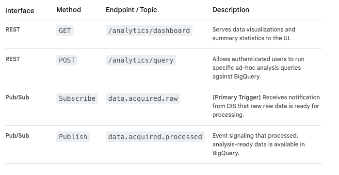

# Data Analytics MicroService

The **Data Analytics Service (DAS)** is where raw data is transformed into actionable intelligence that drives the "Learn" phase of the DBTL cycle. It consumes raw data events and orchestrates the complex processes of cleaning, transforming, aggregating, and analyzing data generated by the in vitro lab before it is used for in silico modeling.

This service runs within the **GCP GKE environment**, uses Cloud Dataflow for processing jobs, reads heavily from **Cloud Storage**, writes processed data to the high-performance **BigQuery** data warehouse, and uses **Cloud Pub/Sub** for event coordination.

## Data Analytics Service: Key Responsibilities

- **ETL (Extract, Transform, Load):** Manages the data pipeline to clean, normalize, and standardize heterogeneous lab data.

- **Data Quality Assurance:** Implements robust quality control checks (e.g., flagging outliers, confirming control values are within range).

- **Feature Engineering:** Prepares data in formats optimized for subsequent machine learning model consumption.

- **Statistical Analysis:** Performs initial statistical analysis to generate basic insights for researchers.

## Technical Design Details

### 1. API Endpoints (REST & Event-Driven)

The DAS is primarily event-driven for its ETL processes but exposes REST APIs for the Web Frontend to perform interactive analysis and visualization.

### 2. Service Interactions

- **Receives from Data Ingestion Service:** Notification events about available raw data files in Cloud Storage.

- **Reads from Cloud Storage:** Extracts the raw data files for processing.

- **Orchestrates Cloud Dataflow:** Launches scalable data processing jobs (using Apache Beam/Flink) to run the ETL pipelines.

- **Writes to BigQuery:** Loads cleaned and structured data into the data warehouse, partitioning by `tenant_id` and `experiment_id`.

- **Triggers In Silico Modeling Service:** Publishes the `data.acquired.processed` event when significant new data is available for model retraining.

### 3. Data Model (BigQuery & Cloud SQL)

The DAS uses BigQuery as its primary destination for structured, analytical data.

- **BigQuery (Data Warehouse):** The optimized, columnar storage location for analysis-ready data.

  - `processed_experimental_results` table: Normalized data across all experiments.
  - `model_features_ready` table: Data specifically structured for ML model training input.

- **Cloud SQL (Metadata DB):** Stores information about the ETL pipelines themselves (e.g., job history, run times, validation success rates).

### 4. Workflow Logic (Internal to DAS)

The DAS manages complex data processing pipelines:

1.  **data.acquired.raw Event Trigger:** A Pub/Sub event arrives with pointers to the new raw data files in Cloud Storage.

2.  **Job Launch (Cloud Dataflow):** The DAS launches a serverless Dataflow job to execute a pre-defined Beam/Flink pipeline. This scales dynamically to handle the processing load.

3.  **ETL Pipeline (Dataflow):**

    1.  **Extract:** Reads raw files from Cloud Storage.
    2.  **Transform:** Applies QC checks, normalization algorithms, and feature engineering logic (ensuring multi-tenant separation).
    3.  **Load:** Loads the structured data into the correct BigQuery tables.

4.  **Publish data.acquired.processed Event:** Once the dataflow job successfully completes, the DAS publishes an event, signaling the In Silico Modeling Service that new data is ready for the "Learn" phase.
