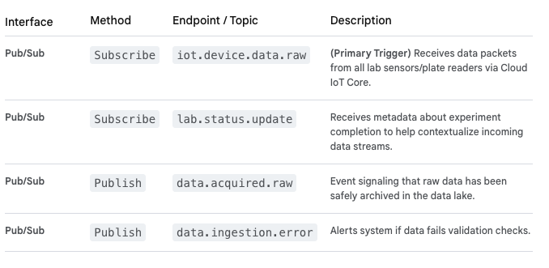

#   Data Ingestion MicroService

The **Data Ingestion Service (DIS)** is the entry point for all data generated by the in vitro laboratory hardware. Its critical role is to securely capture, validate, and standardize raw data streams before they are processed by the analytics services or stored in the data lake. This service ensures data integrity from the physical sensor level up to the computational analysis layer.

The DIS runs within the **GCP GKE/Cloud Run environment**, receives events from the **Cloud Pub/Sub broker** and **Cloud IoT Core**, and writes raw data to **Cloud Storage** and structured metadata to **Cloud SQL**.

##  Data Ingestion Service: Key Responsibilities

-   Secure Ingestion: Acts as the secure interface for data coming from the IoT layer.
-   Validation & Standardization: Ensures data conforms to expected formats and is assigned correct metadata (e.g., experiment ID, timestamp, tenant ID).
-   Raw Data Storage: Persists the original, immutable raw data (the source of truth) in the data lake.
-   Event Generation: Notifies downstream services (like the Analytics Service) that new data is ready for processing.

##  Technical Design Details

### 1. API Endpoints (REST & Event-Driven)

The DIS primarily consumes events from the IoT layer and publishes new events for downstream analytics services. It typically does not expose many external REST APIs to the UI.

### 2. Service Interactions

-   **Receives from Cloud IoT Core:** The raw data stream entry point (via Pub/Sub topic).

-   **Writes to Cloud Storage:** Stores the raw, immutable data files (e.g., .csv, .json, .tiff images).

-   **Writes to Cloud SQL:** Updates the database with pointers to the location in Cloud Storage and relevant metadata.

-   **Sends to Data Analytics Service:** Publishes an event that triggers the analytics service to pick up the newly ingested raw data for processing.

### 3. Data Model (Cloud SQL / Cloud Storage)

The DIS primarily uses Cloud Storage as its main repository for raw data files.

-   **Cloud Storage (Data Lake):**
    -   Tenant-specific folder structure: `gs://<bucket_name>/<tenant_id>/<experiment_id>/<timestamp>/raw_data.csv`

    -   Stores data immutably (locked storage policies can be used for data integrity).

-   **Raw_Data_Pointers Table (Cloud SQL):**
    -   data_pointer_id
    -   tenant_id
    -   experiment_id
    -   storage_uri (Pointer to the file in Cloud Storage)
    -   ingestion_timestamp
    -   validation_status

### 4. Workflow Logic (Internal to DIS)

The DIS workflow is highly automated and focused on high-throughput reliability:

1.  **iot.device.data.raw Event Trigger:** A new data packet arrives via Pub/Sub from a lab device.

2.  **Validation:** The service checks the packet's integrity, format, and metadata (e.g., hardware_id, tenant_id, job_id).

3.  **Archival (Cloud Storage Write):** The raw data payload is immediately written to a time-stamped location in Cloud Storage.

4.  **Metadata Update (Cloud SQL Write):** A record is created in the Raw_Data_Pointers table in Cloud SQL.

5.  **Publish data.acquired.raw Event:** Once safe storage is confirmed, the DIS publishes this new event to Pub/Sub. This signals to the Data Analytics Service that it is safe to begin the processing pipeline (the "Process" phase of the DBTL cycle).

6.  **Error Handling:** If validation fails, the data is archived in an Error_Bucket in Cloud Storage, and a data.ingestion.error event is published for investigation.

