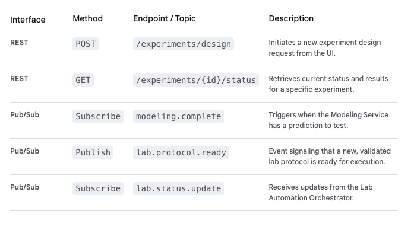

# Experiment Management Service (EMS)

The Experiment Management Service (EMS) is a core orchestration component of the platform. Its primary function is to bridge the gap between in silico predictions (the "Design" phase) and in vitro execution (the "Build" phase).

Designed as a stateless microservice running within our GCP GKE/Cloud Run environment, it will primarily communicate via the Cloud Pub/Sub event broker and interact with the Cloud SQL database for state management.

 EMS: Key Responsibilities
Experiment Design Orchestration: Translates high-level research goals into a detailed, executable experimental protocol.
Protocol Validation: Ensures proposed experiments are scientifically sound and feasible given available lab resources.

 Workflow Coordination: Manages the sequence of operations within the lab.
Status Tracking: Maintains the real-time status of all active experiments.

## Technical Design Details

1. **API Endpoints (REST & Event-Driven)**

The EMS will expose a REST API for the Web Frontend and utilize Pub/Sub for internal system communication. 

2. Service Interactions

   The EMS acts as a hub, coordinating several other services:

   **•** **Receives from In Silico Modeling Service:** "Here are 10 promising compounds and their predicted toxicity scores."

   **•** **Queries Compound Library Service:** "Do we have enough of Compound X? Is the cell line available in inventory?" (via Cloud SQL/Cloud Storage)

   **•** **Sends to Lab Automation Orchestrator:** "Run Protocol #42, use Compound X from storage location A1, follow this exact plate map."

   **•** **Receives from Lab Automation Orchestrator:** "Protocol #42 started," "Error occurred on step 3," "Execution complete."

3. Data Model (Cloud SQL)

The EMS manages complex state data within a relational database (Cloud SQL for PostgreSQL):

**•** Experiments Table:
experiment_id (Primary Key)

- tenant_id (Crucial for SaaS multi-tenancy)
- status (Design_Requested, Designing, Validating, Ready, Running, Complete, Failed)
- protocol_reference_id
- start_time, end_time
- user_id_requested_by

**•** Experiment_Compounds Table: Links compounds/materials to specific experiments.

**•** Protocols Table: Stores standard operating procedures (SOPs) as templates that the EMS uses to generate executable instructions.

4. Workflow Logic (Internal to EMS)
   The core logic within the EMS follows a state machine pattern driven by events:

   1. design_requested Event: EMS receives a modeling complete event or API call.
   2. Validation Check: Queries inventory/resources via the Compound Library Service.
   3. Protocol Generation: If resources are available, EMS selects the appropriate template from its Protocols table.
   4. Publish lab.protocol.ready Event: Publishes a structured, machine-readable protocol (e.g., in a standard JSON format like AnIML or SiLA) to Pub/Sub.
   5. Status Updates: Listens for lab.status.update events from the Lab Orchestrator to transition the experiment status from Ready to Running to Complete.

This design ensures the EMS is the reliable command center for all physical lab operations, while remaining loosely coupled from the hardware itself through the event-driven architecture.
