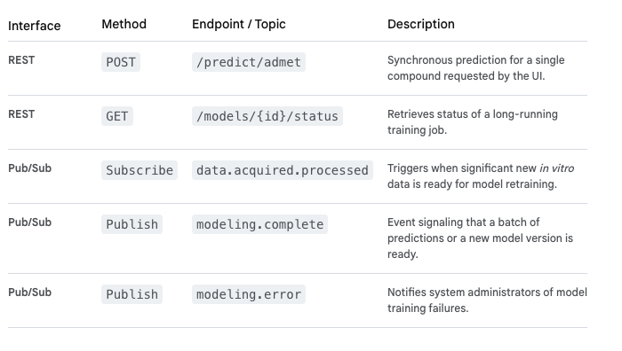

#   In Silico Modeling MicroService

The **In Silico Modeling Service** is the intelligence center of the platform. Its primary function is to leverage computational power and machine learning (ML) models to predict biological outcomes, prioritize candidates (e.g., potential drug compounds), and guide efficient experimental design within the "Design" and "Learn" phases of the DBTL cycle.

This service runs within the **GCP GKE** environment, potentially utilizing GPU-accelerated nodes for intensive computations, and interacts heavily with **BigQuery** and **Cloud Storage** for data access and model training.

## In Silico Modeling Service: Key Responsibilities
-   **Prediction Generation:** Executes established models (e.g., QSAR, molecular docking) to predict properties like toxicity (ADMET), efficacy, and binding affinity.

-   **Model Training & Retraining:** Continuously updates and refines ML models using new in vitro data ingested into BigQuery.

-   **Hypothesis Optimization:** Suggests the next best experiment to run based on Bayesian optimization or active learning techniques.

## Technical Design Details

### 1. API Endpoints (REST & Event-Driven)

The Modeling Service uses a mix of synchronous REST APIs for immediate predictions requested by the UI and asynchronous Pub/Sub events for large-scale training jobs and result notifications.

###  2. Service Interactions

-   **Receives from Data Analytics Service:** Notification that new processed data is available in BigQuery for training.

-   **Reads from BigQuery & Cloud Storage:** Accesses massive historical datasets for training and validation.

-   **Sends to Experiment Management Service:** Publishes the modeling.complete event containing a list of top candidate molecules and their suggested in vitro protocols.

-   **Sends to Analytics Service:** Stores model performance metrics back into the data warehouse.

### 3. Data Model & Storage

This service relies heavily on external data storage rather than its own dedicated operational database.

-   **Cloud Storage (Data Lake):** Stores model artifacts, raw data features, and trained model files (e.g., Pickle files, TensorFlow SavedModel formats).

-   **BigQuery (Data Warehouse):** The primary source of truth for all historical in vitro data used for training ML models. This data is multi-tenant partitioned.

-   **Cloud SQL (Metadata DB):** Stores metadata about model versions, validation metrics, and performance tracking (e.g., accuracy, R-squared values) for auditing purposes.

### 4. Workflow Logic (Internal to Modeling Service)

The service manages complex, long-running computational tasks:

1.  **Event Trigger (data.acquired.processed):** A Pub/Sub event arrives, signaling a significant amount of new data.

2.  **Job Orchestration:** The service initiates a training job, typically using a background worker/queue system within GKE, potentially using GPU nodes.

3.  **Data Fetching:** It queries the relevant data from BigQuery/Cloud Storage, ensuring the `tenant_id` is respected for multi-tenancy.

4.  **Training & Validation:** The ML models are trained and validated against the new data.

5.  **Model Versioning:** If the new model performs better than the existing production model, it is saved to Cloud Storage and the metadata database is updated with the new `model_version_id`.

6.  **Publish modeling.complete:** Publishes the predictions for the top candidates to the Event Broker, initiating the next DBTL cycle step.

This design ensures the platform is continuously learning and optimizing its own research processes based on real-world experimental feedback.

