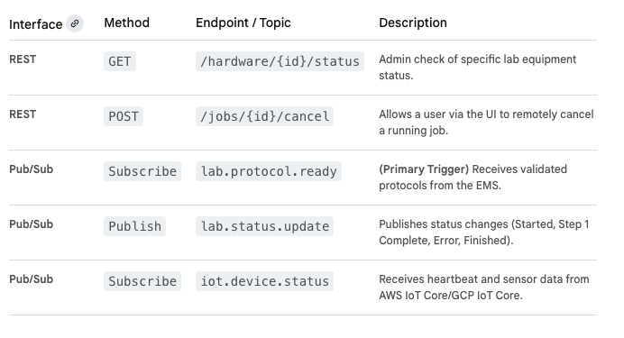

#   Lab Automation Orchestrator MicroService

The **Lab Automation Orchestrator (LAO)** service is the bridge between the digital experimental design and the physical in vitro laboratory hardware. It is responsible for translating abstract protocols into specific, low-level robotic commands and managing the complex state of diverse lab equipment in a multi-tenant environment.

The LAO runs within the **GCP GKE environment** (using standard compute nodes) and primarily communicates via the **Cloud Pub/Sub event broker**, interfacing with local **IoT Gateways** at each client's lab site.

##  Lab Automation Orchestrator: Key Responsibilities
-   Protocol Translation: Converts high-level protocols from the EMS into vendor-specific instruction sets (e.g., G-code for certain robots, specific commands for liquid handlers).

-   Job Queuing & Prioritization: Manages the queue of experiments ready to run on specific lab hardware units.

-   Hardware State Management: Tracks the real-time status of all connected IoT lab devices (Available, Running, Error, Maintenance).

-   Error Handling & Alerting: Detects hardware failures, stops runs safely, and notifies relevant services/users. 

##  Technical Design Details

### 1. API Endpoints (REST & Event-Driven)

The LAO is primarily driven by internal events and exposes minimal REST endpoints, mostly for administrative status checks.

### 2. Service Interactions

-   **Receives from Experiment Management Service:** Executable protocol specifications.

-   **Queries Compound Library Service:** Confirms storage coordinates right before execution to ensure accuracy.

-   **Sends Commands to Cloud IoT Core (via MQTT):** Dispatches commands to the specific IoT Gateway at the client site.

-   **Receives Data from Cloud IoT Core (via Pub/Sub):** Ingests raw data streams and status updates from the lab equipment sensors.

### 3. Data Model (Cloud SQL / BigQuery)

The LAO primarily deals with ephemeral job states and relies on the event broker for communication rather than heavy database operations. 

-   **Execution_Jobs Table (Cloud SQL):**
    -   job_id
    -   tenant_id
    -   experiment_id (FK to EMS)
    -   hardware_id (FK to Hardware_Registry)
    -   status (Queued, Running, Paused, Complete)
    -   current_step, total_steps
    -   protocol_payload_ref (Pointer to Cloud Storage for the full protocol JSON)

-   **Hardware_Registry Table (Cloud SQL):** A master list of all connected physical devices (make, model, serial number, location, current availability/health).

### 4. Workflow Logic (Internal to LAO)

The LAO manages a delicate, real-world operation:

1.  **lab.protocol.ready Event:** LAO consumes an event, checks the Hardware_Registry for the first available, compatible device for the tenant_id.

2.  **Job Queuing:** Creates an entry in the Execution_Jobs table with status Queued.

3.  **Command Translation:** When the device is available, the LAO translates the generic protocol specification into the specific command language required by that physical liquid handler/robot/plate reader.

4.  **Dispatch via IoT Core:** Securely sends commands via MQTT to the local IoT Gateway at the client site.

5.  **Real-time Monitoring & Status Update Loop:** Listens continuously for iot.device.status events. If an error is detected, it automatically issues a STOP command to the hardware and updates the job status to Failed, publishing a lab.status.update event with the error details.

6.  **lab.status.update (Complete):** Once all steps are finished, it publishes the final completion event, which triggers the Data Ingestion Service to begin processing the results of the now-completed experiment.

