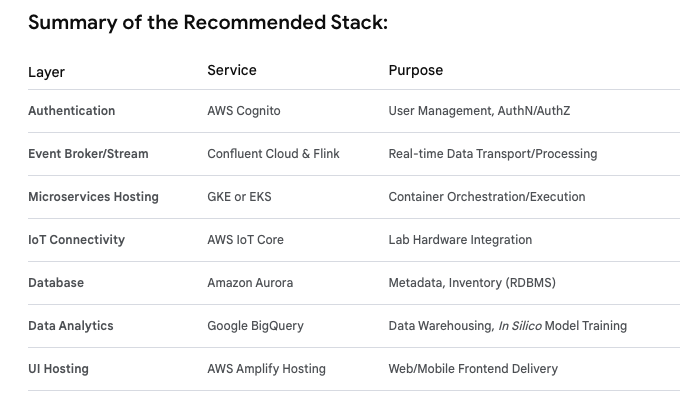

# Multi Cloud Tools for In Silico-In Vitro SaaS Platform with Pre Clinical

We should select best-of-breed cloud services for the layers of the in silico-in vitro SaaS platform.
The goal is to select managed services that reduce operational burden and provide high scalability for a SaaS environment.

Here are suggested cloud services for the remaining layers:

## 1. User Interface (UI) Layer

We need a scalable way to host the Web and Mobile frontends and serve them globally with low latency.

**. Suggested Service: AWS Amplify Hosting or Google Firebase Hosting**

- Why: These services offer global CDN (Content Delivery Network) delivery, simple deployment pipelines, custom domain management, and automatic SSL certificates. They integrate seamlessly with modern frontend frameworks (React, Vue, Angular) and are very cost-effective. AWS Amplify Hosting integrates nicely with your use of AWS Cognito for authentication.

## 2. Integration & IoT Layer (The Automated Lab)

This layer manages connectivity between the physical lab hardware and the cloud microservices.

**. Suggested Service: AWS IoT Core**

   -   **Why:** AWS IoT Core is a highly mature and scalable IoT platform. It provides robust device authentication, secure communication channels (MQTT, WSS), and a rules engine to ingest data streams directly into your Confluent Cloud event broker or data storage without needing a custom server solution. Its device management features are excellent for managing potentially hundreds of lab gateways across different client sites in a SaaS model.

## 3. Data & Storage Layer

We need reliable data storage that supports multi-tenancy and high-performance analytics.

**Suggested Services:**

**- Data Lake/Warehouse (Raw & Processed Data): Google BigQuery or AWS Redshift** - **Why (BigQuery):** As mentioned previously, BigQuery excels in serverless analytics, making it ideal for the "Learn" phase of the DBTL cycle. It handles massive, complex datasets with ease and scales automatically for SaaS billing models. - **Why (Redshift):** A very capable alternative within the AWS ecosystem, offering robust performance for complex SQL queries on petabyte-scale data.

**- Database (Metadata & Inventory): Amazon Aurora (PostgreSQL-compatible)** - **Why:** Aurora provides a highly available, high-performance managed relational database that is compatible with PostgreSQL. It supports the "Shared Database, Separate Schema" multi-tenancy model very well and handles the transactional needs of inventory management and experimental metadata tracking.

## 4. Backend Microservices Layer

The services themselves need a place to run reliably and scale automatically.

**. Suggested Service: Google Kubernetes Engine (GKE) or Amazon Elastic Kubernetes Service (EKS)** - **Why:** Kubernetes (K8s) is the industry standard for deploying, managing, and scaling microservices. GKE and EKS are fully managed K8s services that simplify operations. They provide the flexibility to deploy services written in any language and manage inter-service communication efficiently, connecting easily to the Confluent event broker and the databases chosen above.

## 5. Data Pipelines & Event Bus with Confluent Cloud and Apache Flink

This is perhaps the most exciting part of the stack for a data-intensive platform like this.

**Pros:**
**. Scalability & Resilience:** Confluent Cloud (managed Kafka) provides an incredibly robust, scalable event backbone necessary for high-throughput lab data streams and inter-service communication.

**. Real-time Processing (Flink):** Apache Flink is the industry standard for stateful stream processing. This is perfect for the "Learn" and "Analytics" phases of your DBTL cycle:

    -   You can use Flink to clean, transform, and aggregate raw IoT sensor data in real-time before it even hits your data lake.

    -   Flink can monitor data streams for anomalies (e.g., equipment failures) and trigger alerts immediately.

**. Reduced Operational Overhead:** Using managed services (Confluent handles Kafka ops) frees engineers to focus on building research features.

**Considerations:**

**Cost:** Confluent Cloud can become expensive as data volumes scale compared to self-hosting Kafka or using cheaper alternatives like AWS Kinesis/GCP Pub/Sub. You gain features and ease of use, but you pay for them.

## Summary of the Recommended Stack:

