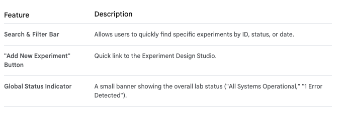

# Real-time Status Dashboard

The Real-time Status Dashboard is another key feature within the main Web Portal UI. While the Experiment Design Studio focuses on initiation and the Data Visualization tools focus on analysis, the Status Dashboard provides immediate operational visibility, crucial for monitoring active experiments within a high-throughput automated lab setting.

It functions as the "mission control" center for researchers and lab managers, leveraging the event-driven backend to display live updates without requiring manual page refreshes.

## Design Approach: Event-Driven UI

The UI needs to be highly reactive. Instead of constantly polling the backend APIs for updates, the ideal design uses persistent connections to receive updates as soon as they happen.

**- Technology:** We would use WebSockets (or AWS's/GCP's managed WebSocket services, like API Gateway WebSockets) to maintain a live connection between the frontend browser and a dedicated `Notification Service` microservice on the backend.

**- Data Source:** The dashboard subscribes to events like `lab.status.update, modeling.complete, and system.error` via the WebSocket connection.

## Ideal UI Layout & Key Features

The layout is designed for at-a-glance monitoring of multiple simultaneous operations within a multi-tenant environment.

### 1. Main Layout: Dashboard Cards

The main area of the dashboard uses a card-based layout, where each card represents a running experiment or modeling job launched by the current tenant.

### 2. Individual Experiment Status Cards

Each card provides a summary of a single operation. The UI framework manages the state of these cards as WebSocket messages arrive.

- Card Header:

  - Experiment ID & Name: (e.g., "Tox Screen v1.2")
  - Status Badge: Dynamic color-coded badge (Running [Blue], Complete [Green], Failed [Red], Queued [Gray]).

- Card Body (Real-time Progress):

  - Progress Bar: Shows the current progress (e.g., "Step 12 of 96: Dispensing Compound X"). Updates in real-time via WebSocket messages from the Lab Automation Orchestrator.
  - Hardware Used: (e.g., "Liquid Handler A, Incubator 3")
  - Time Metrics: "Started: 10:30 AM", "Est. Complete: 1:45 PM".

- Card Footer (Actions & Details):
  - [View Details] Button: Navigates to a detailed log view of that specific experiment.
  - [Cancel Run] Button: Sends an API call to the Lab Automation Orchestrator to immediately halt the physical operation.

### 3. System Alerts Modal/Toast Notifications

A separate, non-intrusive area (like a "toast" notification system) in the corner of the screen handles immediate, critical system alerts.

- Example Alert: "⚠️ Hardware Error Detected: Liquid Handler A reported a pipette jam."

## Data Flow & Interactivity

**1. Connection:** When the user loads the dashboard, the UI establishes a WebSocket connection via the API Gateway to the Notification Service.

**2. Authentication:** The connection is authenticated using the user's JWT (ensuring only updates relevant to their tenant are received).

**3. Event Handling:** The Notification Service consumes relevant events from GCP Pub/Sub and pushes them down the WebSocket connection to the browser.

**4. UI Update:** The frontend JS framework instantly updates the corresponding card's progress bar, status badge, or text without a page refresh, providing a true real-time experience.

[Real-Time Status Dashboard Layout](./UI-StatusDashboardLayout.html)
