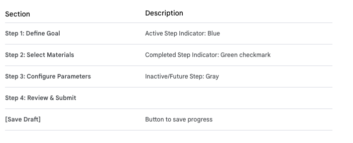
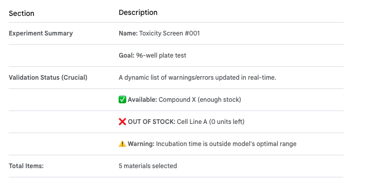

# Experiment Design Studio (EDS)

The **Experiment Design Studio (EDS**) is a critical feature within the main **Web Portal UI,** serving as the user-facing implementation of the "Design" phase of the DBTL cycle. It is where researchers interactively define high-level research questions, select materials, configure parameters, and ultimately trigger the backend systems to create an executable lab protocol.

The EDS is built as a complex, interactive component using the chosen frontend framework (e.g., React/Vue) hosted on Firebase Hosting, communicating securely with the backend microservices via the API Gateway.

## Core Objectives of the EDS

- **Usability & Intuition:** Must translate complex scientific protocols into an intuitive drag-and-drop or wizard-based interface.

- **Real-time Feedback:** Provides immediate validation feedback (e.g., "Compound X out of stock") by querying backend services in real-time.

- **Guidance & Optimization:** Guides the user towards optimal experimental parameters suggested by the in silico models.

## Technical Design & Features

### 1. UI Components & Workflow

The EDS is likely structured as a multi-step wizard or a guided workflow:

**- Step 1: Project & Goal Definition:**

- User selects a research project and high-level goal (e.g., "Toxicity Screening," "Efficacy Testing"). This maps to backend protocol templates.

- UI displays suggestions from the In Silico Modeling Service API ("Model Version 4.2 recommends testing these 50 compounds first").

**- Step 2: Material Selection & Inventory Check:**

- An interactive search interface queries the `Compound Library Service API /compounds/{id}` endpoint.

- **Real-time Validation:** As the user adds items to a "shopping cart," the UI makes synchronous API calls (`/inventory/check`) to the backend to instantly flag availability issues in the inventory.

**- Step 3: Parameter Configuration (In Vitro Specifics):**

- User selects variables like cell lines, concentrations, plate formats (96-well, 384-well), incubation times, etc.

- The UI ensures selected parameters are valid according to predefined constraints fetched from the `Experiment Management Service` API.

**- Step 4: Protocol Review & Submission:**

- A summary screen of the entire experiment design.

- The "Submit" action triggers a `POST` request to the `Experiment Management Service` API `/experiments/design` endpoint.

### 2. Service Interactions (Frontend Perspective)

The frontend communicates with several microservices through the API Gateway, using the authenticated JWT for every request:

- **In Silico Modeling Service API:** Called during Step 1 to fetch ML-driven recommendations for candidate materials.

- **Compound Library Service API:** Called during Step 2 for searching materials and performing live inventory checks.

- **Experiment Management Service API:** The final destination for the completed experimental design payload. It receives the request and begins the orchestration process on the backend.

### 3. UX and Interactivity Considerations

- **Data Visualization Integration:** The EDS should dynamically preview what the experimental plate map will look like, using visual representations of the 96-well plate format with color coding for different compounds/concentrations.

- **Active Guidance:** Use AI-driven suggestions ("Did you mean to use cell line B instead? The model has higher confidence with that one.") fetched from the modeling service API to help researchers optimize their design based on historical data.

- **Error Prevention:** The live inventory check is vital. It prevents the user from submitting a design that the lab automation physically cannot execute, reducing wasted time and effort in the DBTL cycle.

## UI layout for the Experiment Design Studio (EDS)

The ideal UI layout for the Experiment Design Studio (EDS) prioritizes clarity, guided workflow, and real-time validation feedback. A multi-panel, wizard-style layout with interactive data visualization elements works best for translating complex scientific concepts into executable commands.

Here is a conceptual breakdown of the ideal UI layout:

### UI Layout: Experiment Design Studio (EDS)

The layout uses a three-panel design within the main web application framework:

- 1.  Sidebar (Left): Workflow Navigator / Step Tracker
- 2.  Main Area (Center): Interactive Configuration Panels (The Wizard)
- 3.  Sidebar (Right): Summary & Real-time Validation

#### 1. Sidebar (Left): Workflow Navigator (Step Tracker)

This panel manages the user's progress through the design wizard and provides navigation.

#### 2. Main Area (Center): Interactive Configuration Panels

This area changes dynamically based on the current step selected in the Left Sidebar.

**A. Step 1: Define Goal & Model Suggestions**

**- Goal Selector:** Dropdown menu for high-level assay types (e.g., "General Toxicity," "Dose Response").

**- Modeling Service Input:** A panel displaying ML recommendations fetched from the In Silico Modeling Service API. - Example: "AI Suggestion: 50 candidates prioritized by Model v4.2" with an [Auto-Fill Materials] button.

**B. Step 2: Select Materials & Inventory Check**

**- Material Search Bar:** User searches for compounds, cell lines, reagents.

**- Search Results Table:** Displays search results with columns for ID, name, quantity available, and tenant_id confirmation (for multi-tenancy context).

**- Interactive "Shopping Cart":** A list where users drag and drop selected materials. As items are added, the Right Sidebar runs validation.

**C. Step 3: Configure Parameters**

**. Plate Map Visualizer:** A central feature. An interactive grid representation (e.g., a 96-well plate visual).

    -   Users drag materials from the "shopping cart" onto specific wells.
    -   Dropdowns/inputs for concentration levels, incubation times, and replicate definitions.

**. Input Fields:** For global parameters like temperature, humidity, and flow rates (for microfluidics).

**D. Step 4: Review & Submit**

**.Summary Table:** A comprehensive read-only list of all selections.

**Estimated Cost/Time:** Information fetched from the backend (LAO/EMS APIs) providing a projection.

**[Submit Experiment] Button:** The final action that sends the validated payload to the Experiment Management Service API.

#### 3. Sidebar (Right): Summary & Validation

This persistent sidebar provides immediate feedback to prevent errors before submission.

This layout ensures users are guided through the scientific process while the application proactively validates against real-world constraints (inventory, hardware compatibility, ML model ranges) provided by the backend microservices.

[Example Experimental Design Studio](./UI-ExperimentDesignStudioLayout.html)
